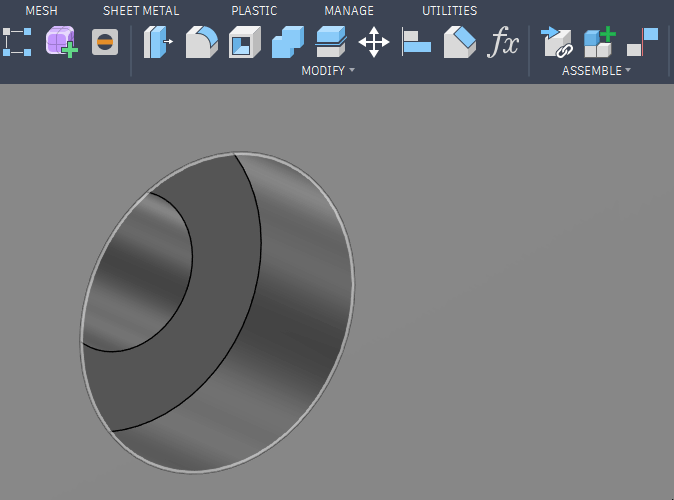
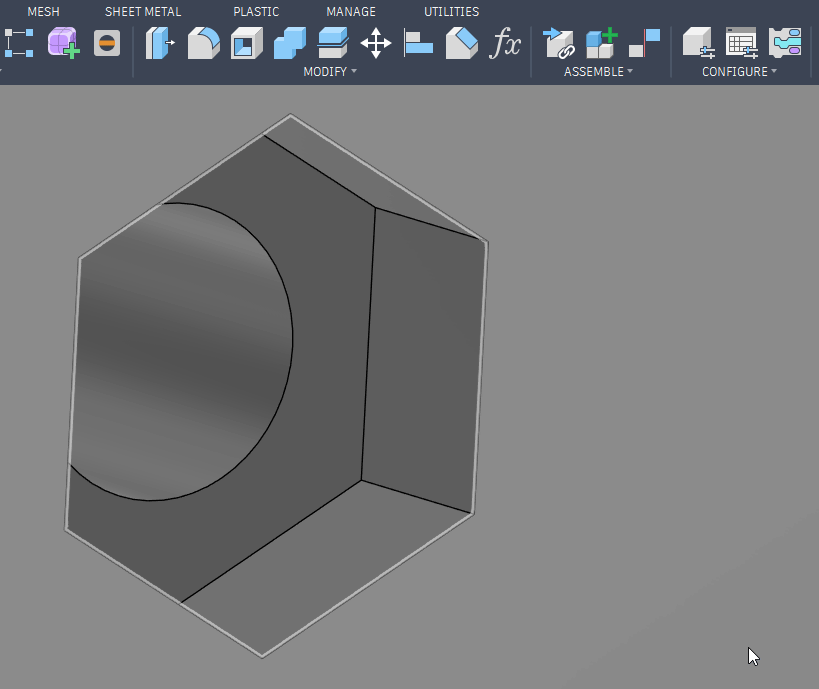
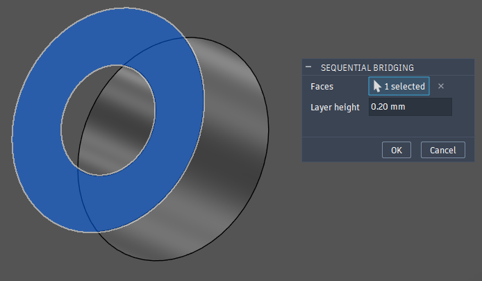

# Fusion 360 Add-In - Sequential Bridging

This is an Autodesk Fusion 360 add-in that will automatically generate sequential bridging cf. [[1](https://www.youtube.com/watch?v=KBuWcT8XkhA),[2](https://blog.rahix.de/design-for-3d-printing/#the-overhanging-counterbore-trick),[3](https://hydraraptor.blogspot.com/2014/03/buried-nuts-and-hanging-holes.html?m=1)] used for FDM 3D printing.

Works on holes

and on nuts

## Results

Before:

After:

# Installation

Open *Utilities -> Add-Ins* (or press SHIFT+S), click the **+** next to *My Add-Ins* and browse to the *Sequential Bridging* folder inside this repo. Fusion remembers the location and loads it on every start, so the folder has to stay where it is.

If you would rather not keep the download around, copy the *Sequential Bridging* folder into `C:\Users\yourname\AppData\Roaming\Autodesk\Autodesk Fusion 360\API\AddIns\` instead and it turns up under *My Add-Ins* on its own. See the official [guide](https://www.autodesk.com/support/technical/article/caas/sfdcarticles/sfdcarticles/How-to-install-an-ADD-IN-and-Script-in-Fusion-360.html).

Either way, select **Sequential Bridging** under *My Add-Ins* and click *Run*. Tick *Run on Startup* to have it there every time.

## Usage

1. Click **Sequential Bridging** in the *SOLID -> CREATE* panel
2. Select the flat face around each hanging hole or nut pocket, as many as you like
3. Check the layer height
4. Click OK

The face has to be either a hole between two concentric circles or a hexagonal pocket around a hole, as in the images above. Anything else is reported and skipped, so one stray pick in a multiple selection will not stop the rest.

# Configuration

The cuts are driven by a user parameter called `seq_bridge_height`, which the add-in creates on first use and which defaults to 0.2 mm. The first bridge is cut one layer deep and the second two.

Set it to your printing layer height. Editing it later, either in the dialog or under *Modify -> Change Parameters*, updates every bridge in the design at once.

# Development

Point the green **+** in the *Scripts and Add-Ins* dialog at the *Sequential Bridging* folder in your clone. Fusion then runs the code where it sits, with no copying and nothing to keep in sync. *Unlink* in the same dialog undoes it.

Modules stay loaded for the whole Fusion session, so a *Stop* and *Run* in the Add-Ins dialog would not normally pick up an edit. That is what `reloadOnStart` in *Sequential Bridging.py* is for. To debug, press the *Debug* button in the same dialog and attach with the *Fusion 360: Attach* configuration.

Completion for `adsk.*` comes from Fusion's own stub definitions, which *.vscode/settings.json* puts on the analysis path. That folder sits outside the versioned install, so it survives Fusion updates.

# Credits

- The layer height parameter comes from an idea by [Barney15e](../../issues/3)
- The fully constrained sketch comes from [Arsenii Tymoshenko](../../pull/2)
